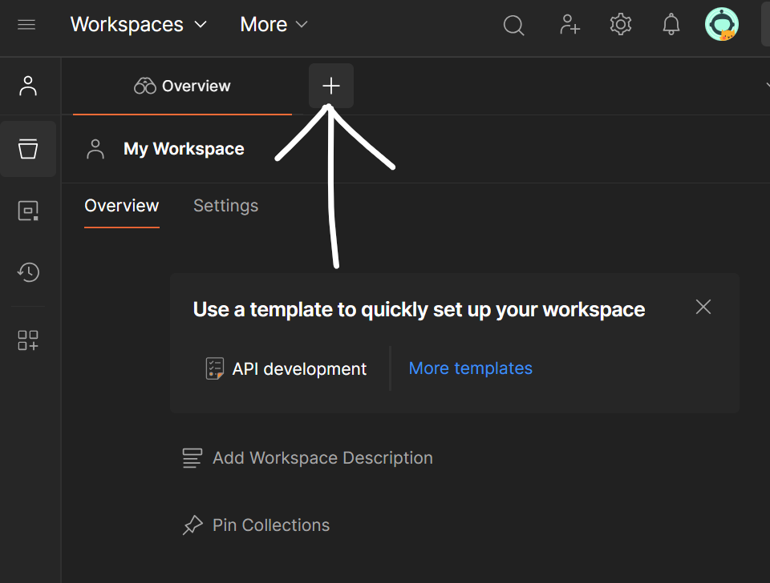
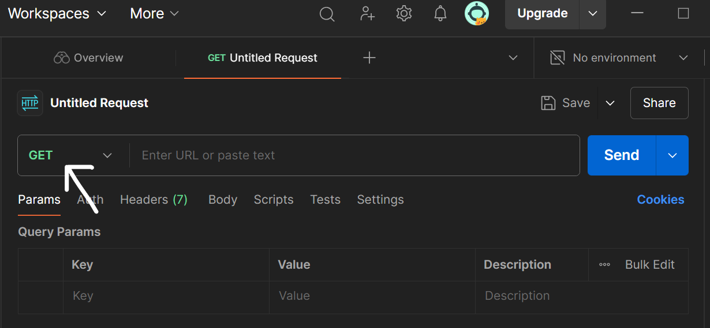
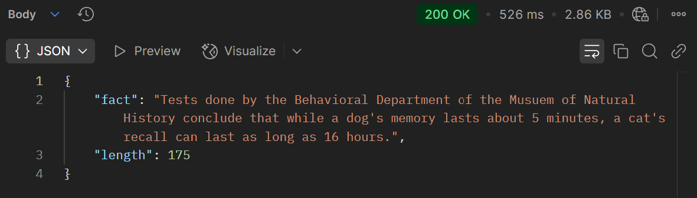

# Complete guide to API Testing, API Test Automation and API Monitoring

> The items listed here will prepare you well for a technical interview at just about any software company
> and will also enhance your performance in your professional role. 
>
> *Best of luck to you!*

---
<index>
## Table of Contents

### The Study Plan


- [What is it?](#what-is-it)
- [Why use it?](#why-use-it)
- [How to use it](#how-to-use-it)
- [Don't feel you aren't smart enough](#dont-feel-you-arent-smart-enough)
- [A Note About Video Resources](#a-note-about-video-resources)
- [Choose a Tool](#choose-a-tool)
- [Books for API Testing](#books-for-api-testing)
- [Interview Prep Books](#interview-prep-books)
- [What you won't see covered](#what-you-wont-see-covered)


### Topics of Study
#### API Overview
- [What is API?](#what-is-api)
- [What are HTTP methods?](#what-are-http-meathods)
- [How API works?](#how-api-works)
- [Types of API](#types-of-api)
- [Common API architectural designs](#common-api-architectural-design)

#### Postman
- [What is Postman](#what-is-postman)
- [Key Tools in Postman](#key-tools-in-postman)
- [Postman Installation and SetUp](#postman-install-setup)
- [Get First Response from Postman](#first-respons-from-postman)
- [Understanding Response](#understandig-response)


</index>


## Why use it?

If you want to excel as a QA engineer, software tester, or automation expert, mastering API testing is essential. APIs are the backbone of modern software systems, and understanding how to test them ensures that the applications you work on are robust, reliable, and scalable.

Whether you're just starting your journey in quality assurance or you're an experienced professional looking to expand your skill set, this guide will help you.  

When I began exploring API testing, I didn't know the difference between REST and SOAP, let alone how to validate API responses or design automated API tests. I had no idea how to set up tools like Postman, write API test scripts, or integrate API monitoring into a CI/CD pipeline. I thought API testing was just about sending requests and checking responses—it’s so much more than that!

API testing requires understanding protocols, authentication methods, performance validation, and much more. While it may seem overwhelming at first, this guide is designed to break it down into manageable steps so anyone, from hobbyists to seasoned professionals, can succeed.

It’s a detailed roadmap, and depending on your familiarity with the concepts, it may take days or even weeks to master. But by the end, you'll have the confidence and skills to handle API testing, automation, and monitoring like a pro.

**Let’s get started and build a strong foundation in API testing!** 


## How to use it 

This guide is structured as an outline, with topics arranged in a logical order from top to bottom. You should tackle the items sequentially for the best learning experience.  


### If You’re Not Using Git  

1. On this page, click the **Code** button at the top.  
2. Select **Download ZIP** to download the repository.  
3. Unzip the file and access the text files directly.  
4. Open the files in any code editor that supports markdown to view the content in a structured and readable format. 


### If You’re Comfortable with Git  

1. **Fork the Repository**  
   - Visit the repository's GitHub page and click on the **Fork** button.  
   - The repository will now appear in your GitHub account.  

2. **Clone the Repository**  
   Run the following commands to clone the repository to your local system and set up a working branch:  
   ```bash
   git clone git@github.com:<your_github_username>/API-Testing.git
   cd API-Testing
   git checkout -b progress
   git remote add upstream https://github.com/aniket7r/API-Testing.git
   git fetch --all


## Don't feel you aren't smart enough

 Add some motivation here for learners

## A Note About Video Resources

Attach video resouces here

## Choose a Tool

This guide will focus primarily on **Postman**, a powerful tool for API testing and automation. Postman allows you to create detailed API requests, run tests, automate workflows, and integrate with CI/CD pipelines. It’s a popular tool used in the industry, so mastering it will be valuable for your career.

## Books for API Testing

Attach some good books for api testing

## Interview Prep Books

You don't need to buy a bunch of these. "Cracking the coding Interview" is prolly enough for overall prepration and ...... for API Testing 
- [Cracking the Coding Interview, 6th Edition](http://www.amazon.com/Cracking-Coding-Interview-6th-Programming/dp/0984782850/)
    - Good for overall interview prepration

Ask experts about this and attach some good interview book for api testing that they used.

## What you won't see covered

This guide focuses on practical API testing with Postman. It will not cover:
- Server-side implementation details or architecture (e.g., how to build an API from scratch)
- Integration with other testing frameworks (e.g., Selenium, Cypress)


## Let's Get Started

 

## API Overview
### What is API?
- API stands for Application Programming Interface.
- The word Application refers to any software with a distinct function.
- Interface can be thought of as a contract of service between two applications.
- This contract defines how the two communicate with each other using requests and responses.

You can understand this as an API is like a waiter in a restaurant: the application (client) tells the waiter (API) what you want (request), and the waiter brings the food (response) from the kitchen (server).


You can try this api which sends list of universities in response, just copy it and paste on your browser search:
```
http://universities.hipolabs.com/search?country=United+States
```

### What are HTTP methods?
A set of actions that clients can perform on a resource using the HTTP protocol.
HTTP is like a delivery service for the internet. It carries your requests (like ordering a package) to a server (the warehouse) and brings back responses (the package) to your browser.


#### What do HTTP meathods do?
- GET: Retrieves data from a resource 
- POST: Creates a new resource or submits an entity to a resource 
- PUT: Replaces an existing resource with an updated version 
- DELETE: Removes a resource from a server 
- HEAD: Requests a response similar to a GET request, but without a response body 
- CONNECT: Creates a connection with a server-side resource, often a proxy server

Later we will see them in detail, how they work.

### How API works?
Working of API is quite simple, you have an **Endpoint** which is a specific URL where you send the request, like a door to a resource. For example, /articles for everything related to articles.
Add there are **Method** which are action you want to perform like:
- GET to fetch data.
- POST to add new data.
- PUT to update data.
- DELETE to remove data.
You can also send extra information with the request, like filters or details (e.g., topic=tech to get only tech-related articles), these are called **Parameters**
And for other extra content like authentication tokens or content type (e.g., JSON) in Key-value pairs, you can put them in **Headers**
And finally **Body** where the actual data you send for creating or updating something, like the title and content of a new article.


### Types of API
Just for the knowledge, there are 3 types of APIs:
- ***Private APIs***: Used within an organization to connect internal systems (e.g., login, feed, messaging). Not for third parties.

- ***Public APIs***: Open to third-party developers for accessing data or services (e.g., Stripe for payments). Can be free or paid.

- ***Partner APIs***: Shared between companies for collaboration, with strict access control (e.g., data exchange between two businesses).


### Common API architectural designs
- ***REST***: It's like navigating through different web pages with distinct URLs for each action (e.g., /user, /products). Each page does a specific job using simple HTTP methods (GET, POST).

- ***SOAP***: Same as sending a structured form with specific fields (XML) to a server for processing. It’s secure and formal, but often slower and used in more complex systems.

- ***GraphQL***: It is such as querying a search engine with exactly the data you need, all from a single search box. It saves time by getting everything in one request.

- ***Webhooks***: Like subscribing to an update service that sends you a notification (HTTP request) when something specific happens (like a new message or payment).

- ***gRPC***: Like connecting two systems over a high-speed, dedicated link, allowing them to communicate seamlessly and quickly, with defined protocols for faster data transfer.

That was all the APIs basics you needed.
Now, let's learn about basics of Postman and get our first response from Postman.

## Postman basics

### What is Postman
Postman is a powerful collaboration platform for API development and testing. It have a user-friendly interface to create, test, debug, document, and monitor APIs. Postman is widely used by developers and QA teams due to its ease of use, automation capabilities, and robust toolset for managing the entire API lifecycle.


### Key Tools in Postman

*   **Collections**: Group and organize your API requests for better management and sharing. Like you can group all ```/user``` endpoints (GET, POST, DELETE) in one folder to test user-related APIs.
    
*   **Environment Variables**: Use placeholders like ```{{base_url}}``` for dynamic values across requests. Use ```{{base\_url}}``` to switch between ```https://dev.api.com``` and ```https://prod.api.com```.
    
*   **Pre-request Scripts**: Automate tasks like generating tokens or setting variables before sending a request. You can auto-generate JWT tokens for authentication before sending a request.
    
*   **Tests Tab**: Write assertions (e.g., check status codes, response data) to validate API behavior. For example validate response.status is 200 and data.name equals "John Doe" after a GET request.
    
*   **Mock Servers**: Simulate APIs for testing without waiting for the real backend. Simulate the ```/orders``` API to test frontend while the backend is still in development.
    
*   **Monitor**: Schedule automated API tests to track performance and uptime. Like checking the ```/health``` endpoint hourly to ensure the API is running.
    
*   **Runner**: Run multiple requests or collections in a sequence for automation. Testing a collection with 100 requests to validate bulk user creation but you have other good tools for this purpose like JMeter.
    
*   **Visualize**: Create custom charts and graphs for response data analysis.
    
*   **API Documentation**: Auto-generate docs to share API details with your team.

### Postman Installation and SetUp

Visit Postman [official website](https://learning.postman.com/docs/getting-started/installation/installation-and-updates/) and Install on you system.

### Get First Response from Postman
1. **Open Postman**: Download and open Postman if not installed.
2. **Create a New Request**: Click + or "New" to open a new request tab.

3. **Set the Request Method**: Select GET from the dropdown next to the URL bar.

4. **Enter the Endpoint**: Type or paste https://catfact.ninja/fact in the URL bar.
5. **Send the Request**: Click the Send button.
6. **View the Response**: Check the response body below for a random cat fact.

### Understanding Response


Let's understand the response that you got.
1. **HTTP Status Code**: Here you got 200 code which means the request was successful (OK). You can check other http codes on this [wiki page](https://en.wikipedia.org/wiki/List_of_HTTP_status_codes).
2. **Response Time**: Time taken for the server to respond.
3. **Response Data**: The actual data sent back, usually in JSON format (e.g., cat facts).
4. **Server-sent events**: Body, Cookies, Headers, Test Results
   *Body*: The main content of the response (e.g., fact).
   *Cookies*: Cookies are like small notes the server gives the client to remember info for future requests (e.g., user sessions).
   *Headers*: Metadata about the response, like content type (JSON) or server info.
   *Test Cases*: Displays results of any tests written for the request.
5. *Data type selector*:  Lets you switch how the response data is displayed, based on its format. *(JSON, XML, HTML, RAW, ...)*
