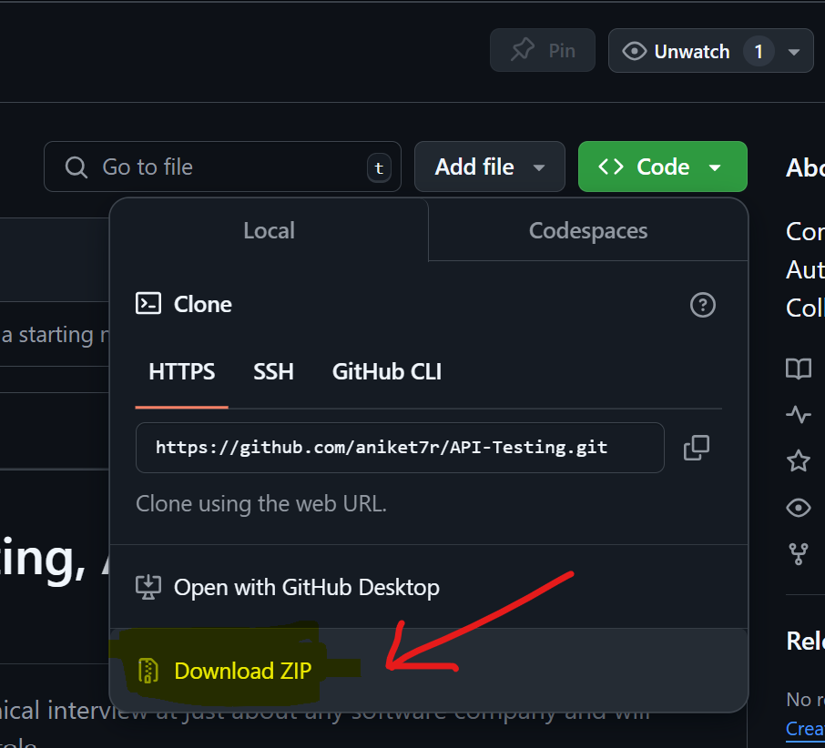

# Complete guide to API Testing, API Test Automation and API Monitoring

> The items listed here will prepare you well for a technical interview at just about any software company
> and will also enhance your performance in your professional role. 
>
> *Best of luck to you!*

---

## Table of Contents

### The Study Plan


- [What is it?](#what-is-it)
- [Why use it?](#why-use-it)
- [How to use it](#how-to-use-it)
- [Don't feel you aren't smart enough](#dont-feel-you-arent-smart-enough)
- [A Note About Video Resources](#a-note-about-video-resources)
- [Choose a Tool](#choose-a-tool)
- [Books for API Testing](#books-for-api-testing)
- [Interview Prep Books](#interview-prep-books)
- [What you won't see covered](#what-you-wont-see-covered)


## Why use it?

If you want to excel as a QA engineer, software tester, or automation expert, mastering API testing is essential. APIs are the backbone of modern software systems, and understanding how to test them ensures that the applications you work on are robust, reliable, and scalable.

Whether you're just starting your journey in quality assurance or you're an experienced professional looking to expand your skill set, this guide will help you.  

When I began exploring API testing, I didn't know the difference between REST and SOAP, let alone how to validate API responses or design automated API tests. I had no idea how to set up tools like Postman, write API test scripts, or integrate API monitoring into a CI/CD pipeline. I thought API testing was just about sending requests and checking responses—it’s so much more than that!

API testing requires understanding protocols, authentication methods, performance validation, and much more. While it may seem overwhelming at first, this guide is designed to break it down into manageable steps so anyone, from hobbyists to seasoned professionals, can succeed.

It’s a detailed roadmap, and depending on your familiarity with the concepts, it may take days or even weeks to master. But by the end, you'll have the confidence and skills to handle API testing, automation, and monitoring like a pro.

**Let’s get started and build a strong foundation in API testing!** 


## How to use it 

This guide is structured as an outline, with topics arranged in a logical order from top to bottom. You should tackle the items sequentially for the best learning experience.  


### If You’re Not Using Git  

1. On this page, click the **Code** button at the top.  
2. Select **Download ZIP** to download the repository.  
3. Unzip the file and access the text files directly.  
4. Open the files in any code editor that supports markdown to view the content in a structured and readable format. 




### If You’re Comfortable with Git  

1. **Fork the Repository**  
   - Visit the repository's GitHub page and click on the **Fork** button.  
   - The repository will now appear in your GitHub account.  

2. **Clone the Repository**  
   Run the following commands to clone the repository to your local system and set up a working branch:  
   ```bash
   git clone git@github.com:<your_github_username>/API-Testing.git
   cd API-Testing
   git checkout -b progress
   git remote add upstream https://github.com/aniket7r/API-Testing.git
   git fetch --all


## Don't feel you aren't smart enough

 Add some motivation here for learners

## A Note About Video Resources

Attach video resouces here

## Choose a Tool

This guide will focus primarily on **Postman**, a powerful tool for API testing and automation. Postman allows you to create detailed API requests, run tests, automate workflows, and integrate with CI/CD pipelines. It’s a popular tool used in the industry, so mastering it will be valuable for your career.

## Books for API Testing

Attach some good books for api testing

## Interview Prep Books

You don't need to buy a bunch of these. "Cracking the coding Interview" is prolly enough for overall prepration and ...... for API Testing 
- [Cracking the Coding Interview, 6th Edition](http://www.amazon.com/Cracking-Coding-Interview-6th-Programming/dp/0984782850/)
    - Good for overall interview prepration

Ask experts about this and attach some good interview book for api testing that they used.

## What you won't see covered

This guide focuses on practical API testing with Postman. It will not cover:
- Server-side implementation details or architecture (e.g., how to build an API from scratch)
- Advanced Postman scripting (beyond the basics)
- Integration with other testing frameworks (e.g., Selenium, Cypress)